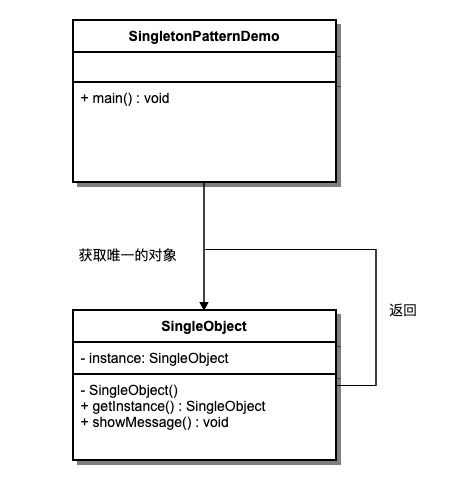

# UML之行为型设计模式

## 职责链模式

### 1. 作用

&emsp;&emsp;避免发送者与接收者耦合，将请求沿责任链传递直到有对象处理。

### 2. 实用场景

&emsp;&emsp;- 多个对象可以处理请求，但具体哪个对象处理未知。  
&emsp;&emsp;- 需要动态指定一组处理对象。

### 3. UML图


### 4. 示例代码

```js
class Handler {
  constructor() { this.next = null; }
  setNext(handler) { this.next = handler; return handler; }
  handle(request) {
    if (this.next) return this.next.handle(request);
    console.log('无处理者');
  }
}

class ConcreteHandlerA extends Handler {
  handle(request) {
    if (request === 'A') console.log('处理者A处理');
    else super.handle(request);
  }
}
class ConcreteHandlerB extends Handler {
  handle(request) {
    if (request === 'B') console.log('处理者B处理');
    else super.handle(request);
  }
}

const handlerA = new ConcreteHandlerA();
handlerA.setNext(new ConcreteHandlerB());
handlerA.handle('B'); // 处理者B处理
```

### 5. 优点

&emsp;&emsp;- 降低耦合；  
&emsp;&emsp;- 增加灵活性；

### 6. 缺点

&emsp;&emsp;- 可能无对象处理请求；  
&emsp;&emsp;- 链过长时调试困难。

## 命令模式

### 1. 作用

&emsp;&emsp;将请求封装成对象，以参数形式传递，实现请求的可撤销、排队和日志记录。

### 2. 实用场景

&emsp;&emsp;- 需要将请求多次撤销/重做。  
&emsp;&emsp;- 需要对请求进行排队或记录日志。

### 3. UML图


### 4. 示例代码

```js
// 接收者
class Receiver {
  action() { console.log('执行请求'); }
}
// 命令接口
class Command {
  execute() {}
  undo() {}
}
// 具体命令
class ConcreteCommand extends Command {
  constructor(receiver) { super(); this.receiver = receiver; }
  execute() { this.receiver.action(); }
  undo() { console.log('撤销操作'); }
}
// 调用者
class Invoker {
  constructor() { this.history = []; }
  executeCmd(cmd) {
    cmd.execute();
    this.history.push(cmd);
  }
  undo() {
    const cmd = this.history.pop();
    if (cmd) cmd.undo();
  }
}

const receiver = new Receiver();
const cmd = new ConcreteCommand(receiver);
const invoker = new Invoker();
invoker.executeCmd(cmd);
invoker.undo();
```

### 5. 优点

&emsp;&emsp;- 请求与执行解耦；  
&emsp;&emsp;- 支持撤销/重做。

### 6. 缺点

&emsp;&emsp;- 增加系统复杂度；  
&emsp;&emsp;- 可能产生大量命令类。

## 解释器模式

### 1. 作用

&emsp;&emsp;为语言创建解释器，定义文法表示及解释器。

### 2. 实用场景

&emsp;&emsp;- 需要在系统中定义一门简单语言。  
&emsp;&emsp;- SQL 解析、表达式计算。

### 3. UML图


### 4. 示例代码

```js
class Context {
  constructor(expression) { this.expression = expression; }
}

class Expression {
  interpret(context) { }
}

class NumberExpression extends Expression {
  constructor(number) { super(); this.number = number; }
  interpret() { return this.number; }
}

class AddExpression extends Expression {
  constructor(left, right) { super(); this.left = left; this.right = right; }
  interpret() { return this.left.interpret() + this.right.interpret(); }
}

const result = new AddExpression(new NumberExpression(5), new NumberExpression(3)).interpret();
console.log(result); // 8
```

### 5. 优点

&emsp;&emsp;- 扩展性好；  
&emsp;&emsp;- 语法易于实现。

### 6. 缺点

&emsp;&emsp;- 复杂文法难以维护；  
&emsp;&emsp;- 执行效率低。

## 迭代器模式

### 1. 作用

&emsp;&emsp;提供顺序访问聚合对象元素的方式，而不暴露其内部表示。

### 2. 实用场景

&emsp;&emsp;- 需要遍历不同聚合结构时；  
&emsp;&emsp;- 支持多种遍历方式。

### 3. UML图


### 4. 示例代码

```js
class Iterator {
  constructor(items) { this.items = items; this.index = 0; }
  hasNext() { return this.index < this.items.length; }
  next() { return this.items[this.index++]; }
}

const items = ['a', 'b', 'c'];
const iterator = new Iterator(items);
while (iterator.hasNext()) { console.log(iterator.next()); }
```

### 5. 优点

&emsp;&emsp;- 简化遍历逻辑；  
&emsp;&emsp;- 支持多种聚合结构。

### 6. 缺点

&emsp;&emsp;- 增加类与接口数量；

## 中介者模式

### 1. 作用

&emsp;&emsp;定义对象间通信的中介者，降低耦合，集中控制交互逻辑。

### 2. 实用场景

&emsp;&emsp;- 多个对象存在复杂交互时；  
&emsp;&emsp;- 希望统一管理通信行为。

### 3. UML图


### 4. 示例代码

```js
class Mediator {
  notify(sender, event) {}
}

class ConcreteMediator extends Mediator {
  constructor(colleagues) {
    super();
    this.colleagues = colleagues;
    colleagues.forEach(c => c.mediator = this);
  }
  notify(sender, event) {
    if (event === 'A') this.colleagues[1].receive();
    if (event === 'B') this.colleagues[0].receive();
  }
}

class Colleague {
  constructor(name) { this.name = name; }
  send(event) { this.mediator.notify(this, event); }
  receive() { console.log(this.name + ' 收到通知'); }
}

const c1 = new Colleague('A');
const c2 = new Colleague('B');
new ConcreteMediator([c1, c2]);
c1.send('A');
```

### 5. 优点

&emsp;&emsp;- 降低耦合；  
&emsp;&emsp;- 集中控制交互逻辑。

### 6. 缺点

&emsp;&emsp;- 中介者逻辑复杂时难以维护；

## 备忘录模式

### 1. 作用

&emsp;&emsp;在不破坏封装性的前提下，捕获对象内部状态，并在需要时恢复。

### 2. 实用场景

&emsp;&emsp;- 需要保存和恢复对象状态时；  
&emsp;&emsp;- 实现撤销操作。

### 3. UML图


### 4. 示例代码

```js
class Memento {
  constructor(state) { this.state = state; }
}
class Originator {
  constructor() { this.state = ''; }
  setState(state) { this.state = state; }
  save() { return new Memento(this.state); }
  restore(memento) { this.state = memento.state; }
}
class Caretaker {
  constructor() { this.mementos = []; }
  backup(originator) { this.mementos.push(originator.save()); }
  undo(originator) {
    const m = this.mementos.pop();
    originator.restore(m);
  }
}

const ori = new Originator();
const care = new Caretaker();
ori.setState('State1');
care.backup(ori);
ori.setState('State2');
care.undo(ori);
console.log(ori.state); // State1
```

### 5. 优点

&emsp;&emsp;- 保存内省状态；  
&emsp;&emsp;- 支持撤销/恢复。

### 6. 缺点

&emsp;&emsp;- 消耗内存；  
&emsp;&emsp;- 破坏封装性增加复杂度。

## 观察者模式

### 1. 作用

&emsp;&emsp;定义对象间一对多依赖，当一个对象状态变化时，所有依赖者都会收到通知。

### 2. 实用场景

&emsp;&emsp;- 事件驱动系统；  
&emsp;&emsp;- MVC 架构中视图更新。

### 3. UML图



### 4. 示例代码

```js
class Subject {
  constructor() { this.observers = []; }
  attach(obs) { this.observers.push(obs); }
  detach(obs) { this.observers = this.observers.filter(o => o !== obs); }
  notify(data) { this.observers.forEach(o => o.update(data)); }
}
class Observer {
  constructor(name) { this.name = name; }
  update(data) { console.log(this.name + ' 收到:' + data); }
}

const subject = new Subject();
const o1 = new Observer('o1');
subject.attach(o1);
subject.notify('消息');
```

### 5. 优点

&emsp;&emsp;- 触发机制灵活；  
&emsp;&emsp;- 低耦合。

### 6. 缺点

&emsp;&emsp;- 可能产生大量通知；  
&emsp;&emsp;- 更新时易出错。

## 状态模式

### 1. 作用

&emsp;&emsp;允许对象在内部状态改变时改变行为，将状态与行为分离。

### 2. 实用场景

&emsp;&emsp;- 对象行为随状态改变；  
&emsp;&emsp;- 避免大量条件判断。

### 3. UML图


### 4. 示例代码

```js
class Context {
  constructor(state) { this.transitionTo(state); }
  transitionTo(state) {
    this.state = state;
    this.state.context = this;
  }
}
class State {
  handle() {}
}
class ConcreteStateA extends State {
  handle() {
    console.log('状态A处理');
    this.context.transitionTo(new ConcreteStateB());
  }
}
class ConcreteStateB extends State {
  handle() {
    console.log('状态B处理');
    this.context.transitionTo(new ConcreteStateA());
  }
}

const context = new Context(new ConcreteStateA());
context.state.handle();
context.state.handle();
```

### 5. 优点

&emsp;&emsp;- 将逻辑分散到状态类；  
&emsp;&emsp;- 易于扩展。

### 6. 缺点

&emsp;&emsp;- 状态类增多；

## 策略模式

### 1. 作用

&emsp;&emsp;定义一系列可互换算法，将每个算法封装为独立的策略类。

### 2. 实用场景

&emsp;&emsp;- 多个算法可选择；  
&emsp;&emsp;- 需要避免条件判断。

### 3. UML图


### 4. 示例代码

```js
class Context {
  constructor(strategy) { this.strategy = strategy; }
  execute() { this.strategy.doAlgorithm(); }
}
class ConcreteStrategyA {
  doAlgorithm() { console.log('算法 A'); }
}
class ConcreteStrategyB {
  doAlgorithm() { console.log('算法 B'); }
}

const context = new Context(new ConcreteStrategyA());
context.execute();
```

### 5. 优点

&emsp;&emsp;- 提高算法可替换性；  
&emsp;&emsp;- 遵循开闭原则。

### 6. 缺点

&emsp;&emsp;- 增加策略类数量；

## 模板方法模式

### 1. 作用

&emsp;&emsp;在父类中定义算法骨架，将步骤实现延迟到子类。

### 2. 实用场景

&emsp;&emsp;- 多个子类有相似算法流程但步骤不同。

### 3. UML图


### 4. 示例代码

```js
class AbstractClass {
  templateMethod() {
    this.step1();
    this.step2();
    this.step3();
  }
  step1() { console.log('默认步骤1'); }
  step2() {}
  step3() {}
}
class ConcreteClass extends AbstractClass {
  step2() { console.log('具体步骤2'); }
  step3() { console.log('具体步骤3'); }
}

new ConcreteClass().templateMethod();
```

### 5. 优点

&emsp;&emsp;- 复用公共流程；  
&emsp;&emsp;- 易于扩展子类步骤。

### 6. 缺点

&emsp;&emsp;- 增加抽象类和子类；

## 访问者模式

### 1. 作用

&emsp;&emsp;将操作封装到访问者中，使得增加新操作时无需修改目标对象结构。

### 2. 实用场景

&emsp;&emsp;- 对象结构稳定但需要频繁新增操作时。

### 3. UML图


### 4. 示例代码

```js
class Visitor {
  visitElementA(e) {}
  visitElementB(e) {}
}
class Element {
  accept(visitor) {}
}
class ConcreteElementA extends Element {
  accept(visitor) { visitor.visitElementA(this); }
  operationA() { console.log('元素 A 操作'); }
}
class ConcreteElementB extends Element {
  accept(visitor) { visitor.visitElementB(this); }
  operationB() { console.log('元素 B 操作'); }
}
class ConcreteVisitor1 extends Visitor {
  visitElementA(e) { console.log('访问者1访问A'); }
  visitElementB(e) { console.log('访问者1访问B'); }
}

const elements = [new ConcreteElementA(), new ConcreteElementB()];
const visitor = new ConcreteVisitor1();
elements.forEach(e => e.accept(visitor));
```

### 5. 优点

&emsp;&emsp;- 易于添加新操作；  
&emsp;&emsp;- 分离数据结构和行为。

### 6. 缺点

&emsp;&emsp;- 增加访问者和元素类数量；

</rewritten_file>
