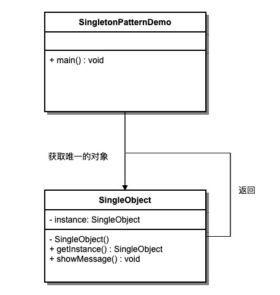

# UML之创建型设计模式

## 工厂方法模式

### 1. 作用

&emsp;&emsp;定义一个用于创建对象的接口，让子类决定实例化哪个类，实现类的实例化延迟到子类进行。

### 2. 实用场景

&emsp;&emsp;- 一个类不知道它所必须创建的对象的具体类型时。  
&emsp;&emsp;- 系统希望将产品的创建集中管理或易于扩展时。  
&emsp;&emsp;- 需要遵循开闭原则，动态添加新产品类型时。  

### 3. UML图


### 4. 示例代码

```js
// 预览器工厂示例
class PDFPreviewer {
  render(content) { console.log('渲染 PDF:', content); }
}
class ImagePreviewer {
  render(content) { console.log('渲染图片:', content); }
}
class VideoPreviewer {
  render(content) { console.log('渲染视频:', content); }
}
class MarkdownPreviewer {
  render(content) { console.log('渲染 Markdown:', content); }
}

class PreviewerFactory {
  static createPreviewer(type) {
    switch(type) {
      case 'pdf': return new PDFPreviewer();
      case 'image': return new ImagePreviewer();
      case 'video': return new VideoPreviewer();
      case 'markdown': return new MarkdownPreviewer();
      default: throw new Error('未知类型');
    }
  }
}

// 使用方式
const previewer = PreviewerFactory.createPreviewer(file.type);
previewer.render(file.content);
```

### 5. 优点

&emsp;&emsp;- 符合开闭原则；  
&emsp;&emsp;- 便于扩展新产品；  
&emsp;&emsp;- 简化客户端代码；  

### 6. 缺点

&emsp;&emsp;- 增加类的数量；  
&emsp;&emsp;- 系统更加复杂；  

## 抽象工厂模式

### 1. 作用

&emsp;&emsp;提供一个创建一系列相关或相互依赖对象的接口，而无需指定它们的具体类。

### 2. 实用场景

&emsp;&emsp;- 系统有多个产品族，但只消费其中某一族时。  
&emsp;&emsp;- 需要产品族对象保持一致性时。  
&emsp;&emsp;- 希望易于替换或扩展产品族时。  

### 3. UML图


### 4. 示例代码

```js
// 抽象工厂接口
class UIFactory {
  createButton() {}
  createCheckbox() {}
}

// 具体工厂：浅色主题
class LightUIFactory extends UIFactory {
  createButton() { return new LightButton(); }
  createCheckbox() { return new LightCheckbox(); }
}

// 具体工厂：深色主题
class DarkUIFactory extends UIFactory {
  createButton() { return new DarkButton(); }
  createCheckbox() { return new DarkCheckbox(); }
}

// 客户端
function renderUI(factory) {
  const btn = factory.createButton();
  const cb = factory.createCheckbox();
  btn.paint();
  cb.paint();
}

const factory = new DarkUIFactory();
renderUI(factory);
```

### 5. 优点

&emsp;&emsp;- 易于交换产品族；  
&emsp;&emsp;- 保持不同产品间的一致性；  
&emsp;&emsp;- 符合开闭原则；  

### 6. 缺点

&emsp;&emsp;- 难以支持新种类的产品；  
&emsp;&emsp;- 扩展困难，需修改抽象层；  

## 单例模式

### 1. 作用

&emsp;&emsp;保证一个类只有一个实例，并提供一个全局访问点。

### 2. 实用场景

&emsp;&emsp;- 全局配置管理；  
&emsp;&emsp;- 日志系统；  
&emsp;&emsp;- 数据库连接池；  

### 3. UML图



### 4. 示例代码

```js
class Logger {
  constructor() {
    if (Logger.instance) {
      return Logger.instance;
    }
    Logger.instance = this;
  }
  log(msg) { console.log('[Log]:', msg); }
}

const logger1 = new Logger();
const logger2 = new Logger();
console.log(logger1 === logger2); // true
```

### 5. 优点

&emsp;&emsp;- 节省资源，避免重复创建；  
&emsp;&emsp;- 提供全局访问点；  

### 6. 缺点

&emsp;&emsp;- 隐藏依赖关系；  
&emsp;&emsp;- 不易拓展和测试；  

## 原型模式

### 1. 作用

&emsp;&emsp;通过复制已有实例来创建新对象，而不是通过 new 操作。

### 2. 实用场景

&emsp;&emsp;- 对象初始化成本较高时；  
&emsp;&emsp;- 需要动态创建相似对象时；  
&emsp;&emsp;- 避免与具体类耦合时；  

### 3. UML图


### 4. 示例代码

```js
class Prototype {
  constructor(name) { this.name = name; }
  clone() { return new Prototype(this.name); }
}

const original = new Prototype('原型对象');
const cloned = original.clone();
console.log(cloned.name); // 原型对象
```

### 5. 优点

&emsp;&emsp;- 性能优越，可快速克隆；  
&emsp;&emsp;- 运行时动态获得对象；  

### 6. 缺点

&emsp;&emsp;- 需处理深浅拷贝问题；  
&emsp;&emsp;- 依赖原型实例；  

## 建造者模式

### 1. 作用

&emsp;&emsp;将一个复杂对象的构建与表示分离，使同样的构建过程可以创建不同的表示。

### 2. 实用场景

&emsp;&emsp;- 对象属性众多且复杂时；  
&emsp;&emsp;- 需要多个配置步骤时；  
&emsp;&emsp;- 希望通过链式调用构建对象时；  

### 3. UML图


### 4. 示例代码

```js
class Product {
  constructor() { this.parts = []; }
  add(part) { this.parts.push(part); }
}

class Builder {
  constructor() { this.product = new Product(); }
  buildPartA() { this.product.add('部件A'); return this; }
  buildPartB() { this.product.add('部件B'); return this; }
  buildPartC() { this.product.add('部件C'); return this; }
  getResult() { return this.product; }
}

const builder = new Builder();
const product = builder.buildPartA().buildPartB().buildPartC().getResult();
console.log(product.parts); // ['部件A','部件B','部件C']
```

### 5. 优点

&emsp;&emsp;- 构建过程清晰；  
&emsp;&emsp;- 易于扩展不同产品；  

### 6. 缺点

&emsp;&emsp;- 需要额外的 Builder 类；  

