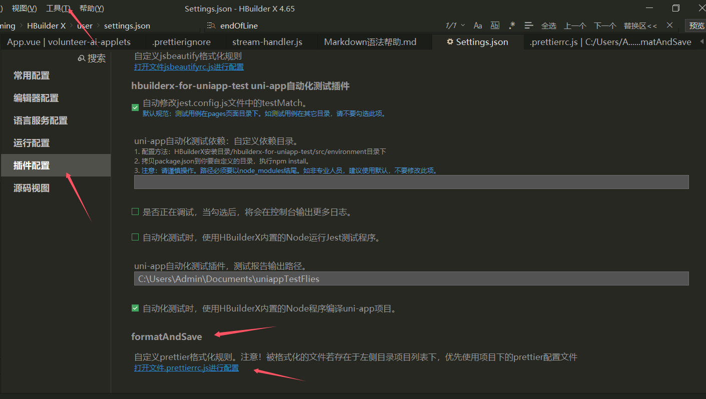
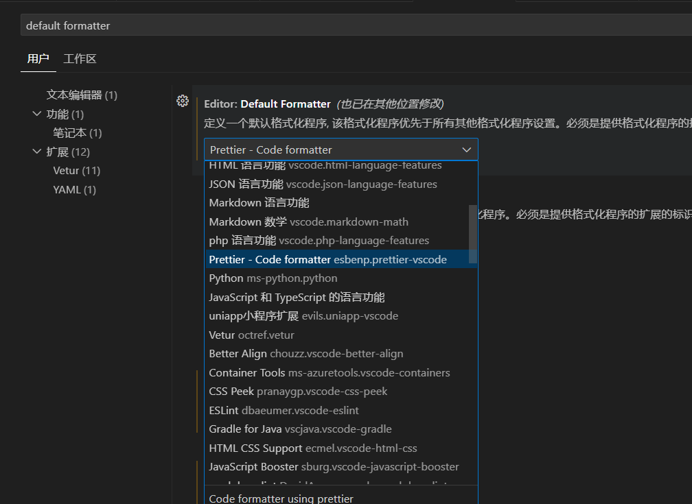
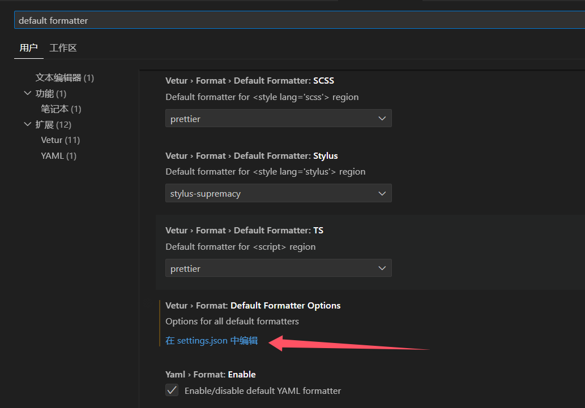

# 格式化规范（工具集配置使用）

## 1、Prettier
&emsp;&emsp;`Prettier` 是一个 强一致性 的代码格式化工具，通过解析代码并重新打印的方式，强制统一团队代码风格（如缩进、引号、换行等），与 `ESLint`（代码质量检查）互补使用。

&emsp;&emsp;[官方文档地址](https://www.prettier.cn/)

### 核心配置规范
#### ① 基础配置文件 `.prettierrc`
```js
module.exports ={
	printWidth: 180, // 指定换行的行长，默认80。设置为180可以避免不必要的换行。
	tabWidth: 2, // 指定每个缩进级别的空格数，默认2。通常情况下，2个空格的缩进更为常见。
	useTabs: true, // 用制表符而不是空格缩进，默认false。大多数项目更倾向于使用空格缩进。
	semi: true, // 在语句末尾添加分号，默认true。设置为true表示在语句末尾添加分号。
	singleQuote: false, // 使用单引号而不是双引号，默认false。如果你希望使用单引号，可以设置为true。
	quoteProps: "preserve", // object对象中key值是否加引号，默认as-needed。只有在必要时才添加引号。
	jsxSingleQuote: false, // 在 JSX 中使用单引号而不是双引号，默认false。如果你希望在 JSX 中使用双引号，可以保持此值为false。
	trailingComma: "none", // 取消尾随逗号，默认es5。设置为"none"表示不添加尾随逗号。
	bracketSpacing: true, // 对象字面量中括号之间的空格，默认true。在对象字面量中添加空格可以提高可读性。
	bracketSameLine: false, // 将>放在多行 HTML（HTML、JSX、Vue、Angular）元素最后一行的末尾，默认false。保持默认值可以提高代码的可读性。
	arrowParens: "always", // 在唯一的箭头函数参数周围包含括号，默认always。这有助于避免一些潜在的语法错误。
	proseWrap: "preserve", // 超过最大宽度是否换行，默认preserve。保持默认值可以避免不必要的换行。
	htmlWhitespaceSensitivity: "ignore", // 指定 HTML、Vue、Angular 和 Handlebars 的全局空格敏感度，默认ignore。忽略多余的空格可以提高代码的整洁度。
	vueIndentScriptAndStyle: false, // vue文件script和style标签中是否缩进，默认false。保持默认值可以避免不必要的缩进。
	endOfLine: "lf", // 行尾换行符，默认lf。使用LF换行符可以确保跨平台兼容性。
	embeddedLanguageFormatting: "auto", // 控制 Prettier 是否格式化嵌入在文件中的引用代码，默认auto。保持默认值可以让 Prettier 自动处理嵌入代码的格式化。
	singleAttributePerLine: false, // 在 HTML、Vue 和 JSX 中强制执行每行单个属性，默认false。保持默认值可以避免不必要的换行。
	parsers: {
		".nvue": "vue", // 将.nvue文件视为Vue文件进行格式化
		".ux": "vue", // 将.ux文件视为Vue文件进行格式化
		".uvue": "vue", // 将.uvue文件视为Vue文件进行格式化
		".uts": "typescript" // 将.uts文件视为TypeScript文件进行格式化
	}
```
#### ② 禁止格式化范围配置 `.prettierignore`
```js
# 忽略目录
/dist/
/node_modules/
/coverage/
/ni_modules/

# 忽略特定文件类型
*.svg
*.html
```
#### ③  IDE自动格式化配置文件 `.setting.json`
```js
{
  // ====================== 安全 & 交互 ======================
  "security.workspace.trust.untrustedFiles": "open", // 对于不受信任的文件，直接打开

  // ====================== 界面设置 ======================
  "workbench.colorTheme": "One Dark Pro", // 代码编辑器主题
  "workbench.iconTheme": "material-icon-theme", // 资源管理器图标主题
  "workbench.layoutControl.enabled": false, // 关闭工作台布局控制
  "window.zoomLevel": 1, // 界面缩放级别

  // ====================== 编辑器行为 ======================
  "editor.fontLigatures": false, // 禁用连字（特殊字符连接显示）
  "editor.mouseWheelZoom": true, // 允许使用鼠标滚轮 + Ctrl 进行缩放
  "editor.defaultFormatter": "esbenp.prettier-vscode", // 默认代码格式化工具（Prettier）
  "editor.formatOnPaste": true, // 粘贴时自动格式化代码
  "editor.formatOnSave": true, // 保存时自动格式化代码
  "editor.linkedEditing": true, // HTML 关联编辑（修改标签时同步修改闭合标签）
  "editor.minimap.enabled": false, // 关闭代码小地图（minimap）
  "editor.tabCompletion": "on", // 启用 Tab 补全
  "editor.fontSize": 16, // 设置字体大小

  // ====================== 文件管理 ======================
  "files.autoSave": "onFocusChange", // 失去焦点时自动保存
  "explorer.confirmDelete": false, // 关闭文件删除确认框
  "explorer.confirmDragAndDrop": false, // 关闭拖拽文件确认框
  "files.trimTrailingWhitespace": true, // 自动删除行尾空格
  "files.insertFinalNewline": true, // 文件末尾自动添加换行符
  "files.exclude": {
    "**/.git": true,
    // "**/.vscode": true,
    "**/.DS_Store": true,
    "**/node_modules": true,
    "**/out": true,
    "**/LICENSE": true
    // "**/.gitignore": true
  }, // 资源管理器中隐藏无关文件夹

  // ====================== 代码格式化（针对不同语言） ======================
  "[html]": {
    "editor.defaultFormatter": "esbenp.prettier-vscode"
  },
  "[javascript]": {
    "editor.defaultFormatter": "esbenp.prettier-vscode"
  },
  "[typescript]": {
    "editor.defaultFormatter": "esbenp.prettier-vscode"
  },
  "[plaintext]": {
    "editor.defaultFormatter": "lkrms.inifmt"
  },

  // ====================== 文件类型关联 ======================
  "files.associations": {
    "*.html": "html",
    "*.vue": "vue",
    "*.ts": "typescript"
  },

  // ====================== JavaScript & Vue 设置 ======================
  "vue.autoInsert.dotValue": true, // Vue 3 模板中自动补全 `.value`
  "javascript.updateImportsOnFileMove.enabled": "always", // JS 文件移动时自动更新 import

  // ====================== Git 相关配置 ======================
  "gitlens.gitCommands.skipConfirmations": [
    "fetch:command",
    "stash-push:command",
    "switch:command"
  ], // GitLens 插件：跳过 fetch、stash、switch 的确认提示
  "git.autofetch": true, // 自动从远程拉取最新代码
  "git.enableSmartCommit": true, // 启用智能提交（未填写 commit message 也能提交）
  "git.confirmSync": false, // 关闭 Git 同步确认框
  "git.path": "D:/dev/app/git/Git/cmd/git.exe", // Git 可执行文件路径

  // ====================== 其他设置 ======================
  "extensions.ignoreRecommendations": true, // 忽略 VS Code 插件推荐
  "diffEditor.ignoreTrimWhitespace": true, // 在 diff 视图中不忽略行尾空格变化

  // ====================== Lingma AI 相关 ======================
  "Lingma.cloudModelAutoTriggerGenerateLength": "long", // AI 生成长度（自动触发）
  "Lingma.cloudModelManualTriggerGenerateLength": "long", // AI 生成长度（手动触发）
  "Lingma.DisplayLanguage": "简体中文", // 界面语言
  "Lingma.PreferredLanguage for AI Chat": "简体中文", // AI 聊天的首选语言
  "Lingma.PreferredLanguage forCommitMessage": "简体中文",
  "remote.SSH.remotePlatform": {
    "hzh.sealos.run_ns-itmbl7jy_java-test": "linux"
  },
  "explorer.confirmPasteNative": false,
  "gitblame.revsFile": [],
  "typescript.updateImportsOnFileMove.enabled": "always"
}

```

### HBX配置参考： `https://blog.csdn.net/hjl_and_djj/article/details/`
- **配置步骤一：** 


### VSC配置参考： `https://blog.csdn.net/m0_64289188/article/details/147110688`
- **配置步骤一：** 


- **配置步骤二：** 


## 2、Husky