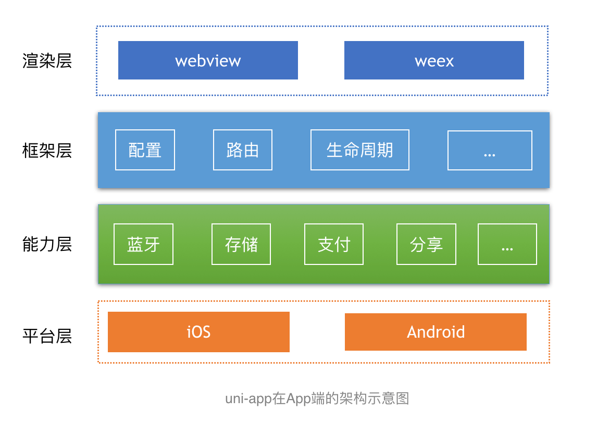
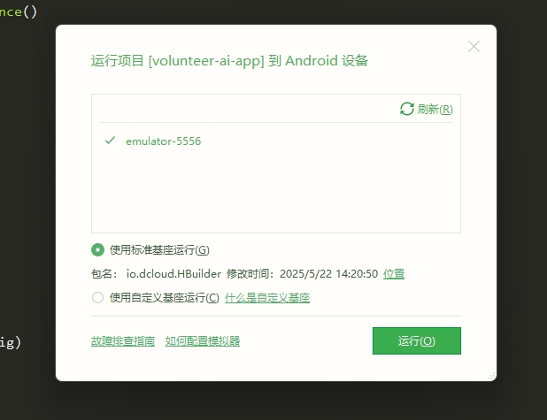
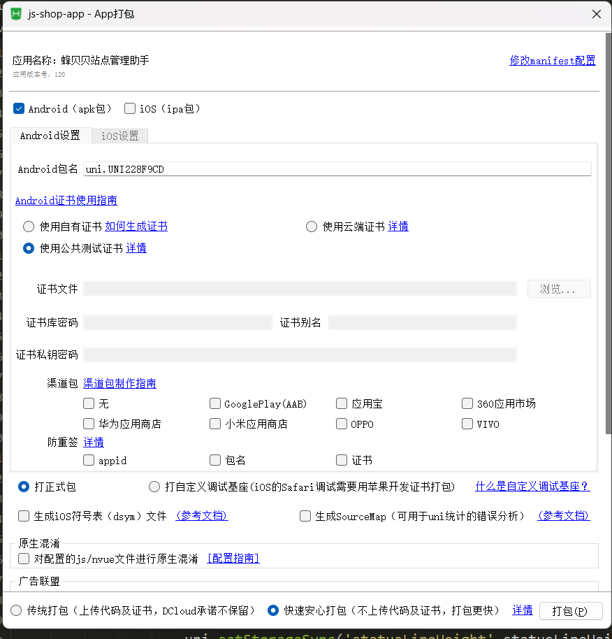

## **移动端APP技术评审报告**
#### **一、原生开发 vs 跨平台开发技术选型分析**

---

#### **1. 原生开发**
##### (1) 概述  
&emsp;&emsp;原生APP开发需要针对相应平台支持的开发工具（Android Studio/Xcode）和开发语言（Java/Kotlin/Swift）进行开发，并直接**直接调用系统SDK API**开发应用。  

**典型场景**：高性能计算、复杂交互动效、完美的用户体验。

##### (2) 核心优势  
| 维度         | 说明                                                                 |
|--------------|----------------------------------------------------------------------|
| **性能**     | GPU/传感器/摄像头等硬件调用零损耗；动画帧率更流畅；无中间层损耗+                |
| **系统集成** | 无缝访问系统级功能，如通知、后台服务、文件系统等OS级能力|
| **体验一致性** | 严格遵循平台设计规范（Material Design/iOS HIG）                     |

##### (3) 缺点  
| 劣势         | 说明                                                                 |
|--------------|----------------------------------------------------------------------|
| **技术栈隔离**     | iOS（Swift/Objective-C）和Android（Kotlin/Java）分别开发独立代码库                |
| **动态化缺陷** | 动态更新受限，有新功能模块更新时只能发版，审核周期长紧急修复难 |
| **开发与维护成本高** | 团队成本高/维护成本高，开发工作量大，学习成本高

##### (4) 技术定位  
✅ **推荐场景**：  
- 强性能需求（AR导航、实时视频处理）  
- 深度OS集成（健康数据同步、后台定位）  

⛔ **慎用场景**：  
- 快速迭代型MVP产品  
- 预算有限的创业项目  

---
**总结：** 原生开发仍是高性能/复杂交互场景的金标准，但是纯原生开发主要面临动态化和开发成本两个问题，而针对这两个问题，诞生了一些跨平台的动态化框架。

#### **2. 跨平台开发**
##### (1) 概述  
&emsp;&emsp;针对原生开发的双平台适配成本高、迭代效率低等核心痛点，跨平台方案通过抽象操作系统差异层，显著提升代码复用率。根据底层渲染机制和技术路径差异，主流框架可分为三大类。

##### (2) 技术路线及对比  
**① WebView(H5+原生桥接)：** 这种 H5 + 原生 的开发模式为混合开发 ，采用混合模式开发的App我们称之为混合应用或 `HTMLybrid App` ，如果一个应用的大多数功能都是 H5 实现的话，我们称其为 `Web App` 。目前国内常用的小程序，其应用层的开发技术栈是 Web 技术栈，而底层渲染方式基本都是 `WebView` 和原生相结合的方式。

**② 原生控件渲染：** 这种 H5 + 原生 的开发模式为混合开发 ，采用混合模式开发的App我们称之为混合应用或 `HTMLybrid App` ，如果一个应用的大多数功能都是 H5 实现的话，我们称其为 `Web App` 。

**③ 自绘引擎：** 这种 H5 + 原生 的开发模式为混合开发 ，采用混合模式开发的App我们称之为混合应用或 `HTMLybrid App` ，如果一个应用的大多数功能都是 H5 实现的话，我们称其为 Web App 。

**对比：** 
| **方案类型**         | **代表框架**       | **渲染机制**                | 优点                          | 缺点                          |
|----------------------|--------------------|-----------------------------|-------------------------------|-------------------------------|
| **WebView(H5+原生桥接)**   | 微信小程序/UniApp  | H5+JSBridge调用原生能力     | ①开发成本低; ②热更新秒级生效; ③生态成熟; | ①性能瓶颈（复杂动画卡顿）;  ②Web与原生体验割裂;  ③如无法访问文件系统、不能使用蓝牙等系统功能 |
| **原生控件渲染**     | React Native/Weex  | JS生成虚拟DOM→映射原生组件  | ① 接近原生体验； ② 部分热更新 | ① 平台适配成本残留； ② 复杂功能需Native补丁 |
| **自绘引擎**         | **Flutter/UniAppX**| Flutter独立Skia引擎或UniAppX的Flex引擎直接绘制UI      | ① 120fps高性能 ② 像素级一致性 | ① 包体积增大30MB+ ② Dart学习曲线陡峭 |

> 🔍 **深度解析选型关键点** 
> - **动态化能力**：WebView方案 > 自绘引擎 > 原生控件渲染  
> - **性能排序**：自绘引擎 ≈ 原生开发 > 原生控件渲染 > WebView  

---

#### **二、UniAPP框架开发APP**

#### **1. 框架简介及优势**
##### (1) 概述  
&emsp;&emsp;uni-app 是高效易用的跨平台开发框架，一次开发即可同时编译 iOS、Android 和小程序。它基于 WebView 和 Weex 双渲染引擎，统一封装了蓝牙、扫码等原生能力（H5+ API），弥补了传统 Weex/React Native API 不足的问题，大幅减少原生开发依赖。uni-app 拥有丰富的插件市场，显著提升开发效率。uni-app目前版本成熟，生态资源丰富，是当今主流的开发框架，案例众多。

#### **2、 nvue文件**
#### (1) 概述  
&emsp;&emsp;uni-app在App端支持两种渲染模式：vuew文件使用WebView渲染，而nvue(即native vue)文件采用基于 weex 改进的原生渲染引擎，开发者可混合使用这两种页面。

&emsp;&emsp;nvue虽然支持跨平台编译到H5和小程序，但因CSS语法受限，更适合App开发。相比传统Weex仅提供渲染能力而API匮乏（依赖原生协作），uni-app通过扩展原生API（如蓝牙、推送等）和完善的插件生态，让前端开发者能独立完成全功能App开发，配合云打包等服务，显著提升效率、降低成本。

#### (2) 优缺点
&emsp; ① 原生高性能渲染

&emsp; ② 增强的内置组件

&emsp;&emsp;⭐ app专业扫码组件

&emsp;&emsp;⭐ 高性能长列表滚动

&emsp;&emsp;⭐ 复杂下拉刷新

&emsp;&emsp;⭐ 高性能瀑布流式布局

&emsp;&emsp;⭐软键盘定制

&emsp;&emsp;⭐ 原生组件层级覆盖（解决 map、video 等原生视图遮挡问题）

&emsp;&emsp;⭐ 专用live-pusher直播推流组件
[参考文档](https://uniapp.dcloud.net.cn/component/list.html)

**❌缺点**

&emsp;&emsp;① CSS 支持受限

&emsp;&emsp;② Canvas 性能较差

#### (3) nvue开发与vue开发的常见区别
&emsp;&emsp;① nvue 页面控制显隐只可以使用v-if不可以使用v-show；

&emsp;&emsp;② nvue 页面只能使用flex布局，不支持其他布局方式；

&emsp;&emsp;③ nvue 页面的布局排列方向默认为竖排（column），可在manifest.json配置中修改；

&emsp;&emsp;④ 文字内容，必须、只能在`<text>`组件下；且只有该标签可以设置字体大小，字体颜色；

&emsp;&emsp;⑤ 不支持在css里写背景图background-image，可使用`<image>`标签控制层级；

&emsp;&emsp;⑥ css选择器支持的比较少，只能使用 class 选择器；

&emsp;&emsp;⑦ class 进行绑定时只支持数组语法；

&emsp;&emsp;⑧ 在 App.vue 中定义的全局js变量不会在 nvue 页面生效。globalData和vuex是生效的；

&emsp;&emsp;⑨ 目前不支持在 nvue 页面使用 typescript/ts；

&emsp;&emsp;⑩ 仍然强烈建议在nvue页面使用原生导航栏；

#### **3、 APP运行及打包**  

#### (1) 运行 
##### &emsp;&emsp;① 模拟器运行
&emsp;&emsp;APP开发和调试过程中，模拟器调试可以更快速的进行热更新以及多类型设备联调，但是模拟器依然无法真实还原大部分正式场景。如真实硬件适配、深度测试厂商SDK兼容性等，所以要明确“真机是生产环境唯一信标，模拟器只是开发加速器”原则。

&emsp;&emsp;[参考文档](https://uniapp.dcloud.net.cn/tutorial/run/installSimulator.html)

##### &emsp;&emsp;② 真机运行
&emsp;&emsp;不管什么类型的项目，都需要连接真实的手机或手机模拟器来运行测试。真机运行的目的，是为了实现代码修改的热刷新，避免打包才能看到效果。在HBuilder中编辑代码，在手机上实时看到修改效果，并且可以在HBuilder控制台看到日志。

&emsp;&emsp;[参考文档](https://uniapp.dcloud.net.cn/tutorial/run/run-app.html)

##### &emsp;&emsp;③ IOS运行配置
&emsp;&emsp;IOS运行需要对标准基座进行签名，有两种方案可以获取IOS签名，标准方案：Apple证书对iOS标准基座签名，需要申请自己的开发者账号并且生成专用的Apple签名证书；代替方案：使用三方工具（如爱思助手）对标准基座签名，主要用于在前期未获得专用签名证书时的过渡方案；

&emsp;&emsp;[参考文档](https://uniapp.dcloud.net.cn/tutorial/run/ios-apple-certificate-signature.html)

#### (2) 打包 
&emsp;&emsp;uni-app提供本地和云端两种打包方式。云打包分为两种模式：① 安心打包（不传代码和证书）；②针对无Mac设备的传统云打包（临时上传证书和代码至官方服务器后立即删除）。云打包服务旨在降低原生开发门槛，帮助没有Mac的前端开发者直接生成iOS/Android安装包。

[打包配置参考文档](https://ask.dcloud.net.cn/article/37979)

**注意：**
- App打包时，注意如果涉及三方sdk，需进行申请并在manifest.json里配置，否则相关功能无法使用。

- iOS App打包需要向Apple申请证书

#### **4、 APP通用模块**  

 &emsp;&emsp;APP 开发中常用的功能模块，涵盖登录、推送、支付、设备交互等核心需求，具体模板包括：
 
| **功能模块**        | **功能说明**                                                                 | **参考文档**                                                                 |
|---------------------|-----------------------------------------------------------------------------|-----------------------------------------------------------------------------|
| **第三方登录**       | 支持微信、QQ、微博、Apple、Google等快速登录                                  | [uni-id 登录体系](https://doc.dcloud.net.cn/uniCloud/uni-id/app.html) |
| **消息推送**         | 实现App消息推送（通知栏、透传），支持个推、极光、厂商通道（华为/小米/OPPO等）   | [UniPush 推送](https://uniapp.dcloud.net.cn/unipush-v2.html)|
| **分享**            | 调用微信、QQ、微博等App的社交分享功能                                        | [uni-share 分享](https://uniapp.dcloud.net.cn/api/plugins/share.html) | |
| **支付**            | 集成微信支付、支付宝支付、Apple Pay 等                                       | [uni-pay 统一支付](https://uniapp.dcloud.net.cn/uniCloud/uni-pay.html) |
| **地图与定位**       | 提供地图显示（高德、Google Map）、定位、路线规划等                            | [uni-map 地图组件](https://uniapp.dcloud.net.cn/component/map) |
| **文件上传/下载**    | 支持本地文件上传至云存储、下载文件                                          | [uniCloud 云存储](https://uniapp.dcloud.net.cn/uniCloud/storage.html) 
| **扫码**            | 支持二维码、条形码扫描（兼容H5/App）                                         | [uni.scanCode](https://uniapp.dcloud.net.cn/api/system/barcode.html) |
| **音频/视频播放**    | 播放本地或在线音视频、直播推流                                               | [video 组件](https://uniapp.dcloud.net.cn/component/video.html)、[live-pusher](https://uniapp.dcloud.net.cn/component/live-pusher.html) |
| **相机拍照/录像**    | 调用相机拍照、录制视频、自定义裁剪                                          | [uni.chooseImage](https://uniapp.dcloud.net.cn/api/media/image.html) |
| **蓝牙设备交互**     | 连接蓝牙设备、收发数据                                                      | [uni蓝牙API](https://uniapp.dcloud.net.cn/api/system/bluetooth.html) |
| **指纹/Face ID**     | 支持生物识别验证（指纹、面部识别）                                           | [uni生物认证](https://uniapp.dcloud.net.cn/api/system/biometric.html) |
| **国际化（i18n）**   | 多语言切换、文本国际化                                                      | [uni-i18n](https://uniapp.dcloud.net.cn/tutorial/i18n.html) |
| **数据缓存**         | 本地缓存管理（如购物车数据、用户历史记录）                                   | [uni.setStorage](https://uniapp.dcloud.net.cn/api/storage/storage.html) |
| **WebView 嵌入**     | 在App内嵌入Web页面                                                          | [web-view组件](https://uniapp.dcloud.net.cn/component/web-view.html) |
| **统计与分析**       | 用户行为统计（如友盟、Google Analytics）                                     | [uni统计](https://uniapp.dcloud.net.cn/tutorial/statistics.html) |
| **广告接入**         | 集成广告模块（如开屏广告、激励视频广告）                                     | [uni-AD](https://uniapp.dcloud.net.cn/component/ad.html) |
| **数据图表**         | 绘制折线图、饼图等数据可视化图表                                            | [uCharts](https://ext.dcloud.net.cn/plugin?id=271) |
| **AR/VR 增强现实**   | 支持AR（如3D模型、物体识别）、VR场景                                         | [WebXR](https://uniapp.dcloud.net.cn/api/AR.html) |
| **AI能力**           | 接入OCR识别、语音合成、人脸识别等AI能力                                      | [uni-AI](https://uniapp.dcloud.net.cn/tutorial/ai.html) |

#### **三、前期准备工作**

