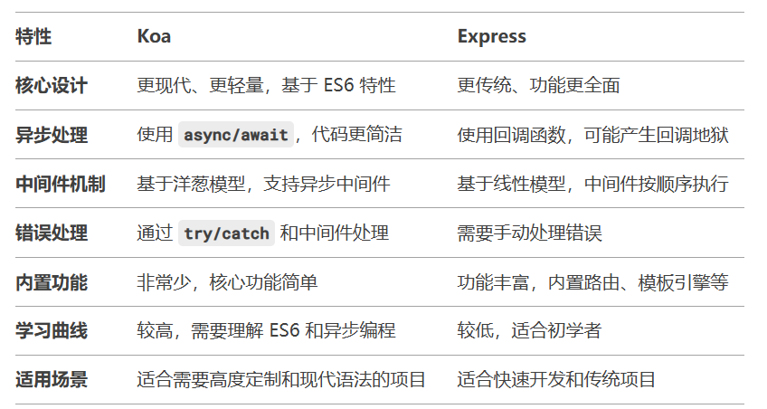
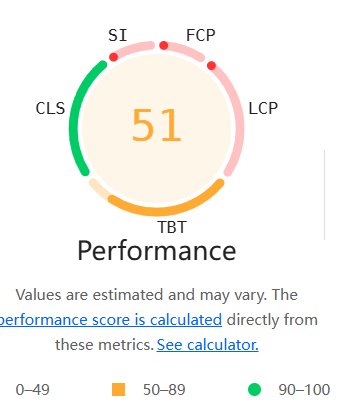

# 2024年12月笔记

### 1、什么是流式渲染，结合slot如何使用

&emsp;&emsp;流式渲染是一种优化技术，用于在加载大量内容时逐步显示数据，而不是一次性加载所有内容。常用的分页加载、无限滚动、懒加载都属于流式渲染；

&emsp;&emsp;NodeJS中的流式渲染的核心思想就是将html文档分块传输到客户端，也不需要整个页面生成完成后再发送，客户端在接收到部分内容后即可开始渲染，是一种优化SSR的渲染方法；可以有效提高首屏加载速度，减少服务器负载，但是实现难度较为复杂；而使用solt可以动态的为渲染的DOM树绑定内容；

```js
//流式渲染nodejs基本实现思路
const Koa = require('koa');
const app = new Koa();
// 假设数据需要5秒的时间来获取
renderAsyncString = async () => {
    return new Promise((resolve,reject) => {
        setTimeout(() => {
            resolve(`<h1>Hello World!</h1>`)
        })
    })
}
app.use(async (ctx, next) => {
    ctx.type = 'html';
    ctx.body = await removeEventListener();
    await next();
});
app.listen(3000, () => {
    console.log('App is listening on port 3000');
})

```

### 2、什么是Koa？有什么作用？和express有何区别？

&emsp;&emsp;Koa是一个基于NodeJS的轻量级应用程序框架，它的目的是更高效、更简洁的进行Node开发，因此采用了ES6的异步特性来进行编码；所以Koa相比于Express会更加易用，因为该框架是Experss原班人马打造的；Koa内部拥有包括内容协商，缓存清理，代理支持和重定向等常见任务的方法；
&emsp;&emsp;核心内容对比：

&emsp;&emsp;&emsp;① 洋葱模型：洋葱模型是Koa框架的核心，Koa 的中间件执行顺序像洋葱一样，从外到内，再从内到外，控制更加精细；Express则是按顺序依次执行；
```js
//每个中间件可以通过await next()将控制权交给下一个中间件，然后再回来继续执行代码
app.use(async (ctx, next) => {
  console.log('Step 1');
  await next(); // 交给下一个中间件
  console.log('Step 4');
});

app.use(async (ctx, next) => {
  console.log('Step 2');
  await next(); // 交给下一个中间件
  console.log('Step 3');
});
```
&emsp;&emsp;&emsp;② 中间件(middleware)：Koa的中间件只接受两个参数cxt和next，而Express则需要三个参数：请求参数，响应参数和next

&emsp;&emsp;&emsp;③ 上下文(Context)：Koa将请求和响应都封装在在ctx对象中处理，使得中间件更容易共享数据和交互，Express则需要将请求和响应单独处理；ctx对象可以用来访问请求数据、设置响应数据(状态码、响应头、响应体等)、操作中间件、异常抛出、设置cookies等等
```js
const Koa = require('koa');
const bodyParser = require('koa-bodyparser');
const app = new Koa();

app.use(bodyParser()); // 解析请求体

app.use(async (ctx) => {
  if (ctx.method === 'POST' && ctx.path === '/submit') {
    const data = ctx.request.body; // 获取请求体
    ctx.body = { message: 'Data received', data };
  } else {
    ctx.status = 404;
    ctx.body = 'Not Found';
    //抛出异常： 抛出 400 错误
    ctx.throw(400, 'ID 不能为空'); 
  }
  //设置cookies
  const count = Number(ctx.cookies.get('count') || 0;
  ctx.cookies.set('count', count + 1); // 设置 Cookie
  ctx.body = `访问次数: ${count + 1}`;
});
app.listen(3000);
```
&emsp;&emsp;&emsp;④  异步流程控制：Koa使用Async和Await来处理异步流程；而Express则是用回调函数来进行处理，容易出现回调地狱，难以维护；

```js
const Koa = require('koa');
const app = new Koa();
app.use(async ctx => {
  ctx.body = 'Hello World';
});
app.listen(3000);
```

[参考文档](https://koa.bootcss.com/#)


### 3、前端常见的错误异常类型有哪些？

&emsp;&emsp;常见错误类型：

&emsp;&emsp;**① SyntaxError：** 解析时发生语法错误，该错误是在构建时发生，非运行时发生，所以无法捕获；

&emsp;&emsp;**② TypeError:** 类型错误，表示不是所期待的类型；

&emsp;&emsp;**③ ReferenceError：** 引用未声明的变量；

&emsp;&emsp;**④ RangeError：** 当一个值不在所允许的范围或集合中；

&emsp;&emsp;**⑤ ResourceError：** 指网络资源加载错误；

### 4、如何监控和捕获项目中的错误异常？

&emsp;&emsp;**①  try...catch：** try..catch作为常用的一种捕获方式，但是只能捕获`运行错误`、`同步错误等`，无法捕获`编译错误`、`异步错误`；而Async/Await是用同步的方法执行异步操作，所以可以在执行过程中使用try...catch进行异步捕获；
```js
try {
  // 尝试执行的代码
} catch (error) {
  // 捕获并处理错误
} finally {
  // 无论是否发生错误，都会执行的代码（可选）
}
//在async/await中使用try...catch
async function myFunction() {
  try {
    const result = await someAsyncOperation(); // 等待异步操作完成
    console.log(result);
  } catch (error) {
    console.error('捕获到错误:', error.message); // 处理错误
  }
}
```

&emsp;&emsp;**②  window.onerror：** window.onerror会返回6个参数，包括错误信息、出错文件、行号、列号、出错对象；但无法捕获编译错误、资源错误；更适合用于错误日志的记录；
```js
window.onerror = function(message, source, lineno, colno, error) {
  console.error('捕获到错误:');
  console.error('消息:', message);
  console.error('文件:', source);
  console.error('行号:', lineno);
  console.error('列号:', colno);
  console.error('错误对象:', error);
  return true; // 阻止默认错误提示
};
// 触发一个错误
undefinedFunction(); // 调用未定义的函数
捕获到错误:
消息: Uncaught ReferenceError: undefinedFunction is not defined
文件: http://example.com/script.js
行号: 10
列号: 5
错误对象: ReferenceError: undefinedFunction is not defined
```

&emsp;&emsp;**③  window.addEventListener('unhandledrejection')：** 无论是Promise还是Async/Await都可以使用这个方法来进行监听捕获；
```js
window.addEventListener('unhandledrejection', function(event) {
  console.error('捕获到未处理的 Promise 拒绝:');
  console.error('原因:', event.reason);
  console.error('Promise 对象:', event.promise);
});
// 未处理的 Promise 拒绝
Promise.reject(new Error('这是一个未处理的错误'));
```
&emsp;&emsp;**④  vue.config.errorHandler：** 只要是Vue中的组件报错都会被这个回调函数捕获,会返回三个参数：错误信息、组件实例、错误上下文信息；
```js
Vue.config.errorHandler = function(err, vm, info) {
  console.error('捕获到 Vue 错误:');
  console.error('错误信息:', err.message);
  console.error('组件实例:', vm);
  console.error('错误上下文:', info);
};
```

&emsp;前端异常监控第三方插件：Fundebug([查看ES6官网文档地址](https://www.fundebug.com/))、Sentry([查看ES6官网文档地址](https://sentry.io/welcome/))；

### 5、前端常用的性能分析工具有哪些

&emsp;&emsp;**① lighthouse：** lighthouse是谷歌自带的性能分析工具，能通过评分直观的看到项目的整体性能情况，还能提出项目的性能问题，其中主要参数包括：FCP、LCP、TBT、SI、CLS以及Performance分析、Accessibility分析、SEO分析等等。


&emsp;&emsp;**② VueDevtool：** 作为Vue项目开发的常用调试工具，其中包含了许多像组件层级结构查看、数据实时监控、事件监听查看、性能分析等功能。

&emsp;&emsp;**③ webpack-bundle-analyzer：** 该插件用于项目中对打包体积及其占比进行直观的展示，以及依赖包体积等，可以在vue.config.js中进行配置；
```js
const BundleAnalyzerPlugin = require('webpack-bundle-analyzer').BundleAnalyzerPlugin;

module.exports = {
  configureWebpack: {
    plugins: [
      new BundleAnalyzerPlugin({
        analyzerMode: 'server', // 启动本地服务器查看报告
        openAnalyzer: true, // 自动在浏览器中打开报告页面
      }),
    ],
  },
  chainWebpack: (config) => {
    // 其他 Webpack 配置
  },
  productionSourceMap: false, // 生产环境禁用 source map
  devServer: {
    port: 8080, // 开发服务器端口
  },
};
```

### 6、前端优化的具体实施方案有哪些

&emsp;&emsp;**① 开发构建阶段：** 按需引入、懒加载(路由懒加载、列表懒加载等)、请求封装、代码精简等；尽量通过减少包体积、减少代码结构、减少首次渲染DOM树等方式进行优化；

&emsp;&emsp;**② 打包阶段：** 配置压缩(代码压缩/静态资源压缩)、分包策略、资源预加载/预请求(默认preload-webpack-plugin插件)；

&emsp;&emsp;**③ 部署线上阶段：** 静态资源缓存、Ngnix配置gzip、CDN负载均衡、开启HTTP2等；

附：HTTP/2 是 HTTP 协议的第二个主要版本，于 2015 年正式发布。它是 HTTP/1.1 的升级版，旨在解决 HTTP/1.1 的性能瓶颈，并提升 Web 应用的加载速度和效率。其主要特性包括：二进制数据传输、多路复用、服务器主动向客户端推送、单一 TCP 连接传输所有数据等；
```js
//在Ngnix中使用HTTP2
server {
    listen 443 ssl http2;
    server_name example.com;
    ssl_certificate /path/to/certificate.crt;
    ssl_certificate_key /path/to/private.key;
    ...
}
//在NodeJS中使用HTTP2
const http2 = require('http2');
const server = http2.createSecureServer({
  key: fs.readFileSync('server.key'),
  cert: fs.readFileSync('server.crt')
});
server.on('stream', (stream, headers) => {
  stream.respond({
    'content-type': 'text/html',
    ':status': 200
  });
  stream.end('<h1>Hello HTTP/2</h1>');
});
server.listen(443);
```

### 7、前端常见的漏洞攻击

&emsp;&emsp;**① XSS跨站脚本攻击：** 恶意脚本被注入到有漏洞的应用程序或网站中，使黑客可以任意操作浏览器返回的内容；预防XSS可以采取的措施包括：输入验证、避免使用不安全的API(innerHTML/document.write等)、使用XSS过滤器、避免拼接SQL查询等等；

&emsp;&emsp;**② CSRF跨站请求伪造：** 作为一种恶意攻击，主要是诱骗已授权的用户进行一些敏感操作，如金融交易等；语法CSRF可以采用的措施包括：使用 `CSRF Token`、验证 `Referer` 和 `Origin` 头、限制敏感操作的 HTTP 方法(避免GET请求等)；

&emsp;&emsp;**③  MitM中间人攻击：** 指攻击者将自己置于应用程序和用户之间以获取敏感数据的攻击方式；

&emsp;&emsp;**④  DoS拒绝服务：**  一种通过向服务器发送大量请求使其无法提供服务的攻击，通常发生在服务端；

&emsp;&emsp;**⑤ 会话劫持：** 黑客可能使用多种技术来窃取用户的唯一会话ID，从而能够劫持活动会话；前端可以通过使用 HTTPS、定期更新会话ID、为 `Cookie` 设置 `Secure` 标志、设置 `HttpOnly` 标志等方法避免；

### 8、前端通常有哪些安全实践

&emsp;&emsp;**1、开发阶段:** 输入验证和转义防止XSS、使用安全的对象方法、为 Cookie 设置 HttpOnly 和 Secure 标志、避免在客户端存储敏感信息或者对敏感信息进行加密存储等

&emsp;&emsp;**2、打包阶段:** 压缩和混淆代码防止逆向工程、移除未使用的代码、检查依赖库的版本及安全性等；

### 9、解构赋值别名

&emsp;&emsp;解构赋值允许从数组或对象的属性中提取值并将其分配给不同的变量；别名允许你在这一过程中重命名变量，这对于处理来自外部来源如 API 的数据时特别有用。

&emsp;&emsp;别名有助于使变量名更直观性、易于理解，从而提高代码的可读性和维护性。通过使用别名，可以避免名称冲突，并增强代码的清晰度，使处理复杂数据结构变得更容易。

```js
const apiResponse = {
      frist_name: 'Kevin',
      last_name: 'tom',
      user_age: "14",
      address: {
        city: "shenzhen",
        zip: "1001"
      }
    }
    const {
      frist_name:fristName,
      last_name:lastName,
      user_age:userAge,
      address:addr
    } = apiResponse
    console.log(fristName); // Kevin
    console.log(lastName); // tom
    console.log(userAge); // 14
    console.log(addr); // {city: 'shenzhen', zip: '1001'}
```

### 10、什么是函数柯里化

&emsp;&emsp;柯里化是一种将接受多个参数的函数转换为一系列仅接受一个参数的函数的过程。这项技术可以让开发者在函数中预设参数，从而使代码更加模块化和可组合。帮助创建更灵活且可重用的函数，尤其是在函数式编程中特别有用，如创建可重用和可配置的函数以应用折扣。

```js
 const applyDiscount = (discount) => (price) => price - (price * discount / 100);
 const tenPercentOff = applyDiscount(10);
 const twentyPercentOff = applyDiscount(20);

 console.log(tenPercentOff(100)); // 90
 console.log(twentyPercentOff(100)); // 80

 const applyTax = (taxRate) => (price) => price + (price * taxRate / 100);
 const applyTenPercentTax = applyTax(10);

 console.log(applyTenPercentTax(100)); // 110
 console.log(applyTenPercentTax(twentyPercentOff(100))); // 88
    
```

### 11、浏览器控制台中preview与response返回数据不同问题

&emsp;&emsp;即精度丢失问题，preview中为响应预览数据，浏览器对响应资源进行了格式化处理；response为原始响应资源，响应资源未作格式化处理；

&emsp;&emsp;问题出现原因：通常后端数据库使用了Long或bigInt数据类型，长度超过17位数字，而浏览器中仅使用Number数字类型进行处理，超出部分会去除补0，从而导致数据精度丢失；

&emsp;&emsp;解决方法：1、将响应数据中的数值转换为string字符串或修改参数长度；

### 12、Vue生产包部署后第三方插件异常报错

&emsp;&emsp;问题原因：打包插件版本低冲突导致异常问题

&emsp;&emsp;解决方法：通过修改bable.config.js编译器配置文件对插件版本进行兼容；

[配置参考](https://www.babeljs.cn/docs/presets)

```js
module.exports = {
  presets: ['@babel/preset-env']
}
```

### 13、微信小程序/UniApp `<web-view>`标签使用限制

&emsp;&emsp;`<web-view>`标签可以作为承载网页的容器。会自动铺满整个小程序页面，`navigation: custom`设置将对该标签无效，内页中会自带返回标签及标题；

&emsp;&emsp;`<web-view>`网页中可使用`JSSDK 1.3.2`提供各种返回小程序页面的接口。 包括：`wx.miniProgram.navigateTo`、`wx.miniProgram.switchTab`、`wx.miniProgram.postMessage`等；

&emsp;&emsp;此外，`<web-view>`中可以通过`JSSDK接口`实现的功能包括：图像接口、音频接口、设备信息接口、地理位置接口、微信扫一扫、微信卡券、长安识别等等；

### 14、信小程序/Uniapp中的分包加载机制

&emsp;&emsp;分包可以有效解决微信小程序主包不能超过2M限制的问题，使用分包可以直接在pages.json文件中什么subPackages字段，然后按照分包路径进行配置；使用分包需要注意：1、tabBar页面必须在主包内；分包之间的文件不能`require`但是可以`require`主包内的文件，使用`分包异步化`可以不受此限制;2、分包之间的资源不可以相互引用，但分包可以使用主包中的资源（实践：主包可以引用分包中小于40k的静态资源文件）；

&emsp;&emsp;分包加载机制进阶：

&emsp;&emsp;1、独立分包：独立分包是小程序中一种特殊类型的分包，可以独立于主包和其他分包运行。从独立分包中页面进入小程序时，不需要下载主包。当用户进入普通分包或主包内页面时，主包才会被下载。一个小程序中可以有多个独立分包。通过在`app.json`的`subpackages`字段中对应的分包配置项中定义independent字段声明对应分包为独立分包。

&emsp;&emsp;2、分包预下载：开发者可以通过配置，在进入小程序某个页面时，由框架自动预下载可能需要的分包，提升进入后续分包页面时的启动速度。对于独立分包，也可以预下载主包。通过在 app.json 增加 preloadRule 配置来控制。

&emsp;&emsp;3、分包异步化：在小程序中，不同的分包对应不同的下载单元；因此，除了非独立分包可以依赖主包外，分包之间不能互相使用自定义组件或进行 `require`。「分包异步化」特性将允许通过一些配置和新的接口，使部分跨分包的内容可以等待下载后异步使用，从而一定程度上解决这个限制。

[参考文档](https://developers.weixin.qq.com/miniprogram/dev/framework/subpackages/basic.html)

### 14、动态加载图片无法即时渲染问题

&emsp;&emsp;异常原因：异步加载和渲染顺序

&emsp;&emsp;当你动态设置图片的 src 属性时，图片的加载是异步的。如果在图片加载完成之前，Vue 组件已经渲染了，可能会导致图片未能立即显示。此时，浏览器需要重新计算布局和绘制页面，才能显示新加载的图片。

### 15、Vue中父传子组件Props数据更新视图不更新问题

&emsp;&emsp;解决方法：1、利用watch监听器监听数据变化，并在DOM渲染后即this.$nextTick方法中进行重新赋值；2、使用子组件绑定的ref直接在父组件在调用子组件方法并传参

```js
  //方法1：子组件中使用
  watch: {
    userInfo: {
      handler(newValue) {
        let that = this
        this.$nextTick(() => {
          that.form = newValue
          that.queryParams.userId = newValue.userId
        })
      },
      immediate: true,
      deep: true
    }
  }
  //方法2：父组件中使用
      this.$nextTick(() => {
        this.$refs.authRolesRef.init(row)
      })
```

### 16、数组的循环迭代/查找方法

&emsp;&emsp;`map()`、`filter()`、`reduce()`、`find()`、`findIndex()`

&emsp;&emsp;`array.indexOf(val,val1...)`：查找数组中是否存在指定的值，存在返回对应索引，不存在返回-1

&emsp;&emsp;`array.includes(val)`：数组中是否存在指定的元素，返回true/false

&emsp;&emsp;`every()`：测试数组中是否所有元素都满足条件

&emsp;&emsp;`some()`：测试数组中是否至少有一个满足条件

### 17、ElementUI 表格勾选默认选中项目错乱

&emsp;&emsp;解决方法：首先需要在表格项中设置`type="selection"`类型，并且需要在`el-table`中指定唯一标识`row-id="rowId"`，最后传入默认选中项目到方法`toggleRowSelection(row)`中即可进行选中；

```js
    toggleSelection(rows:Object) {
      if (rows) {
        rows.forEach((row) => {
          console.log('row', row)
          this.$refs.multipleTable.toggleRowSelection(row)
          console.log(this.$refs.multipleTable)
        })
      } else {
        this.$refs.multipleTable.clearSelection()
      }
    }
```

### 18、Web页面同一浏览器登录不同账号隔离token

&emsp;&emsp;1、将token存储在`sessionStorage`中，因为`sessionStorage`是临时性缓存，存储有效期根据标签页是否存在决定，所以`token`也只是在当前标签页中有效；

&emsp;&emsp;2、如果使用 `Cookie` 存储 `token`，可以为每个用户使用不同的 `Cookie` 名称，以避免数据互串。如在key中拼接上用户ID等；

### 19、如何设置cookies的有效时间

&emsp;&emsp;通过获取当前时间以及过期时间计算出未来过期时间，或者直接设置未来过期时间，并设置expires即可设置cookies的有效时间；

```js
  function setCookies(name, value, minutes) {
      let expires = "";
      if (minutes) {
          const now = new Date(); // 获取当前时间
          const futureDate = new Date(now.getTime() + (minutes * 60 * 1000)); // 计算未来时间
          console.log("未来时间",futureDate);
          expires = "; expires=" + futureDate.toUTCString(); // 转换为 UTC 字符串
      }
      document.cookie = name + "=" + (value || "") + expires + "; path=/"; // 设置 Cookie
  }
```

### 20、外部浏览器H5跳转微信小程序及指定页面

&emsp;&emsp;解决方案：

&emsp;&emsp;1、使用云开发静态网站托管的网页，可以免鉴权跳转任意合法合规的小程序。开通静态网站、绑定自定义域名，需要在「微信开发者工具 - 云开发 - 更多 - 静态网站」里进行，才能拥有免鉴权的能力。

&emsp;&emsp;2、实时生成url_scharm短链，注意安卓系统无法直接跳转需要H5页面中转，并且相同短链一个设备仅能访问一次；

&emsp;&emsp;3、明文 URL Scheme：开发者无需调用平台接口，在MP平台->设置->隐私与安全->明文Scheme拉起此小程序声明后，可自行根据指定格式拼接appid和path等参数，作为明文 URL Scheme 链接。

### 21、ES6数组对象的includes()和indexOf()有什么相同点和不同点

&emsp;&emsp;相同点
&emsp;&emsp;&emsp;1. 功能：两者都用于检查数组中是否包含某个特定的元素。
&emsp;&emsp;&emsp;2. 返回值：两者都可以用于判断元素是否存在于数组中，但返回的结果不同。
&emsp;&emsp;不同点

| 特性 | includes() | indexOf() |
|--------------------|-------------------------------------------|-------------------------------------------|
| 返回值 | 返回一个布尔值 (true 或 false) | 返回元素的索引，如果未找到则返回 -1 |
| 支持 NaN | 支持，includes() 可以正确识别 NaN | 不支持，indexOf() 无法识别 NaN |
| 比较方式 | 使用严格相等 (===) 比较 | 使用严格相等 (===) 比较 |
| 参数 | 只接受一个要查找的元素 | 可以接受第二个参数，指定开始查找的索引 |
| 可读性 | 更加直观，适合用于条件判断 | 需要额外的逻辑来判断返回值 |

